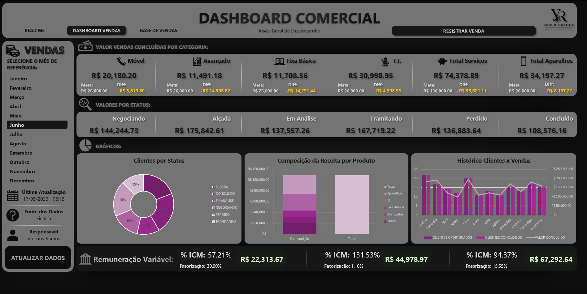
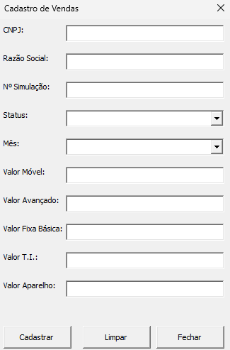
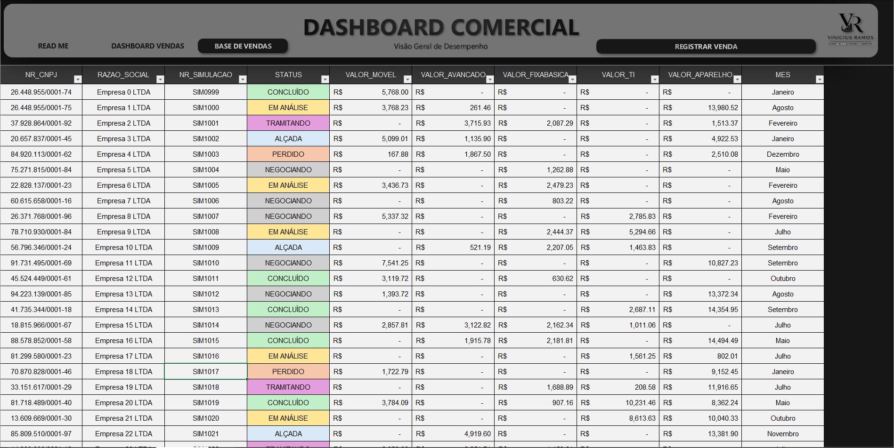

## Dashboard

<p align="center">

</p>

# 📊 Excel Commercial Dashboard

<p align="center">

Dashboard comercial desenvolvido em Microsoft Excel e VBA para automatizar o cadastro de vendas, consolidar indicadores estratégicos e fornecer uma visão interativa do desempenho comercial.

</p>

---

# 📸 Demonstração

## Dashboard

<p align="center">
  
</p>

---

## Cadastro de Vendas

<p align="center">
  
</p>

---

## Base de Dados

<p align="center">
  
</p>

---

# 🚀 Funcionalidades

✅ Dashboard Comercial Interativo

✅ Cadastro automatizado de vendas via VBA

✅ Atualização automática das Tabelas Dinâmicas

✅ Segmentação por mês

✅ Indicadores estratégicos

✅ Gráficos dinâmicos

✅ Estrutura organizada em camadas

✅ Documentação integrada

---

# 📈 Indicadores

O dashboard monitora indicadores comerciais inspirados em um cenário real de vendas B2B.

- Receita Total
- Receita por Categoria
- Receita por Status
- Clientes Oportunados
- Clientes Concluídos
- Histórico Mensal
- ICM
- Fatorização
- Remuneração Variável

---

# 🛠 Tecnologias

| Tecnologia | Utilização |
|---------------------------|---------------------------|
| Microsoft Excel           | Desenvolvimento principal |
| VBA                       | Automação                 |
| Pivot Tables              | Consolidação dos dados    |
| GETPIVOTDATA              | Indicadores               |
| Slicers                   | Filtros interativos       |
| Hyperlinks                | Navegação                 |
| Conditional Formatting    | Destaque visual           |

---

# 🏗 Estrutura do Projeto

```text
Dashboard Comercial.xlsm

│

├── README
│     Documentação
│
├── Dashboard
│     Painel principal
│
├── Base_Vendas
│     Base de dados simulada
│
├── Base_Calculo
│     Consolidação dos indicadores
│
└── UserForm VBA
      Cadastro de vendas
```

---

# ⚙ Como utilizar

1. Baixe o arquivo **Dashboard Comercial.xlsm**

2. Habilite as macros ao abrir o arquivo.

3. Utilize as segmentações para filtrar os indicadores.

4. Clique em **Registrar Venda** para cadastrar uma nova oportunidade.

5. Clique em **Atualizar Dados** para atualizar os indicadores e gráficos.

---

# ⚡ Automações Implementadas

O projeto utiliza VBA para automatizar tarefas operacionais, incluindo:

- Cadastro de novos registros
- Validação de campos obrigatórios
- Inserção automática na base de dados
- Atualização das Tabelas Dinâmicas
- Atualização do Dashboard
- Navegação entre páginas

---

# 💡 Decisões de Projeto

Os indicadores apresentados foram escolhidos com base em um cenário comercial B2B inspirado na minha experiência profissional.

O objetivo foi construir um dashboard que reproduzisse um ambiente real de acompanhamento comercial, priorizando métricas utilizadas na gestão de carteira, acompanhamento de negociações e monitoramento de resultados.

Todos os dados presentes são fictícios e utilizados exclusivamente para fins de estudo e composição de portfólio.

---

# 🎯 Objetivos

Este projeto foi desenvolvido para demonstrar conhecimentos em:

- Excel Avançado
- VBA
- Modelagem de Dados
- Business Intelligence
- Construção de Dashboards
- Visualização de Dados
- Automação de Processos
- Organização de Projetos

---

# 👨‍💻 Autor

**Vinicius Ramos**

Analista Administrativo | Analista de Dados

📧 Sempre aberto a feedbacks, networking e oportunidades profissionais.
